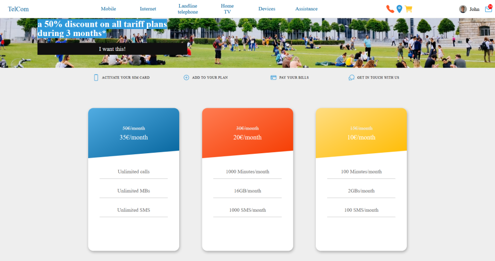

# Project Name
> TelCom is a landing page for a fictional telecommunication company.

See live demo at: https://mtetev.github.io/TelCom/

## Table of contents
* [Screenshots](#screenshots)
* [Technologies](#technologies)
* [Setup](#setup)
* [Status](#status)
* [Contact](#contact)

## Screenshots


## Technologies
* HTML5
* Sass - version 1.26

## Setup
* Install all dependecies with NPM using the ```npm install``` command
* Run the developmnet server using the ```npm devstart``` command or build the css using ```npm build:css``` and open "index.html" located in the main directory

## Status
Project is finished

## Contact
Created by Miroslav Tetevenski. Feel free to contact me at miroslav.tetevenski@gmail.com